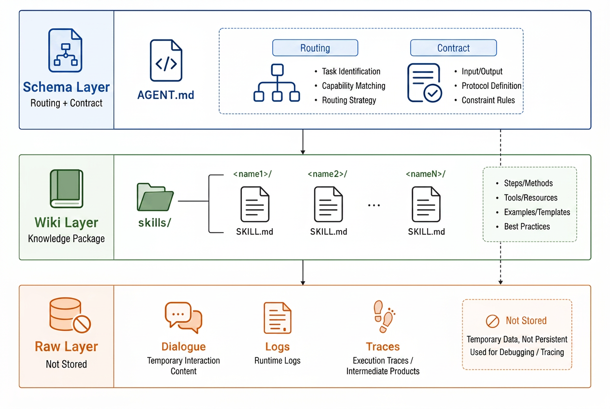
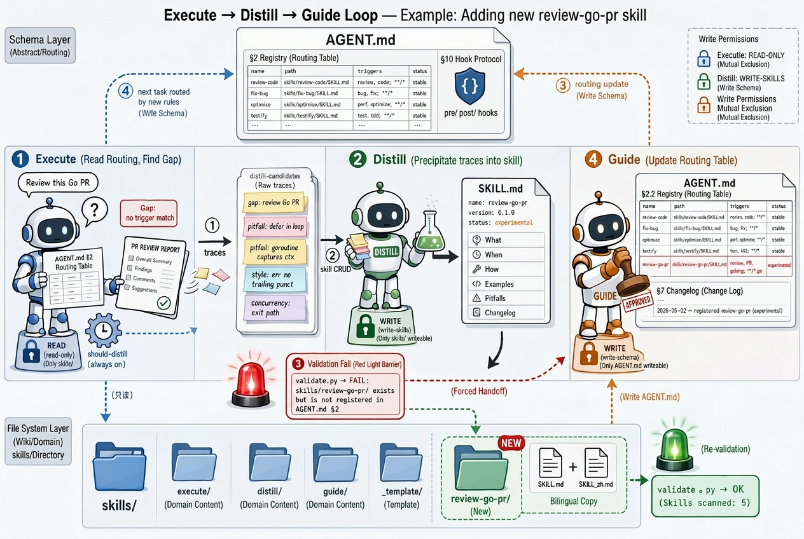

# llm-skill — Execute / Distill / Guide

> English | [中文](./README_zh.md)

A minimal three-layer skill system for LLM agents, inspired by Karpathy's **[LLM-Wiki](https://gist.github.com/karpathy/442a6bf555914893e9891c11519de94f)** idea:



## The closed loop

Three meta-skills operate on the skill system itself:

| Meta-skill | Responsibility | Output |
|---|---|---|
| **execute** | Read `AGENT.md` routing → load the smallest skill subset → finish the task → log reusable signals | deliverable + `distill-candidates` |
| **distill** | Refine traces into new/updated skills per contract | `skills/<name>/SKILL.md` changes |
| **guide**   | Maintain the `AGENT.md` routing table & skill health | `AGENT.md` changes |

```
 [Execute] ──traces──► [Distill] ──skill CRUD──► [Guide] ──routing──► [Execute] ...
```

## Repository layout

```
llm-skill/
├── README.md                       # this file (English default)
├── README_zh.md                    # Chinese
├── CHANGELOG.md                    # append-only
├── AGENT.md                        # Schema: routing + contract (single source of truth)
├── AGENTS.md                       # Codex entrypoint
├── CLAUDE.md                       # Claude Code entrypoint
├── HERMES.md                       # HERMES entrypoint
├── install.sh                      # one-shot install / sanity check
├── scripts/
│   └── validate.py                 # front-matter + routing consistency checker
└── skills/
    ├── execute/     SKILL.md + SKILL_zh.md
    ├── distill/     SKILL.md + SKILL_zh.md
    ├── guide/       SKILL.md + SKILL_zh.md
    └── _template/   SKILL.md + SKILL_zh.md
```

End-to-end pipeline (Execute → Distill → Guide, illustrated with a `review-go-pr` walkthrough):



## Install

### Option A — standalone repo
```bash
git clone <this-repo-url> llm-skill
cd llm-skill
bash install.sh
```

### Option B — mount into an existing project
```bash
git clone <this-repo-url> .llm-skill
ln -s .llm-skill/AGENT.md   ./AGENT.md
ln -s .llm-skill/AGENTS.md  ./AGENTS.md      # for Codex
ln -s .llm-skill/CLAUDE.md  ./CLAUDE.md      # for Claude Code
ln -s .llm-skill/HERMES.md  ./HERMES.md      # for HERMES
ln -s .llm-skill/skills     ./skills
bash .llm-skill/install.sh
```

`install.sh` runs layout checks and calls `scripts/validate.py`.

## Quick start

1. **Run a task** — the agent reads `AGENT.md` §2, routes to ≤ 3 skills, executes, and collects distill candidates.
2. **Add a skill**:
   ```bash
   cp -r skills/_template skills/<your-skill-name>
   # edit SKILL.md (and SKILL_zh.md if you want)
   # ask the agent to run `guide` to register it in AGENT.md §2.2
   ```
3. **Distill a pitfall** — say "distill this" and the agent walks the four-phase SOP in `skills/distill/SKILL.md`.

## Design invariants

- **Domain knowledge belongs only in `SKILL.md`.** `AGENT.md` is pure routing + contract.
- **Disjoint write rights** — Execute (read-only on skills) / Distill (writes skills) / Guide (writes `AGENT.md` only).
- **Lazy loading** — never `ls skills/` and batch-read; match `triggers` first, load ≤ 3 `SKILL.md`.
- **Two required vital signs** on every skill — `version` and `status`.

See [`AGENT.md`](./AGENT.md) for the full contract.

## Compatibility matrix

| Runtime | Entrypoint |
|---|---|
| Codex CLI | `AGENTS.md` |
| Claude Code | `CLAUDE.md` |
| HERMES | `HERMES.md` |
| Anything else | `AGENT.md` directly |

## License

Released under the [MIT License](./LICENSE).
