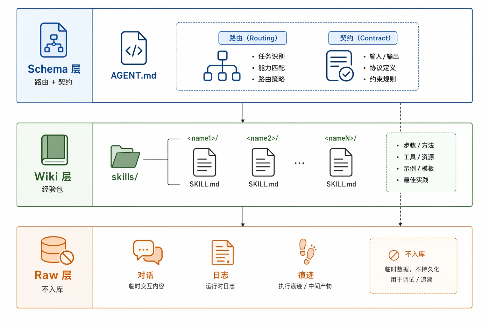
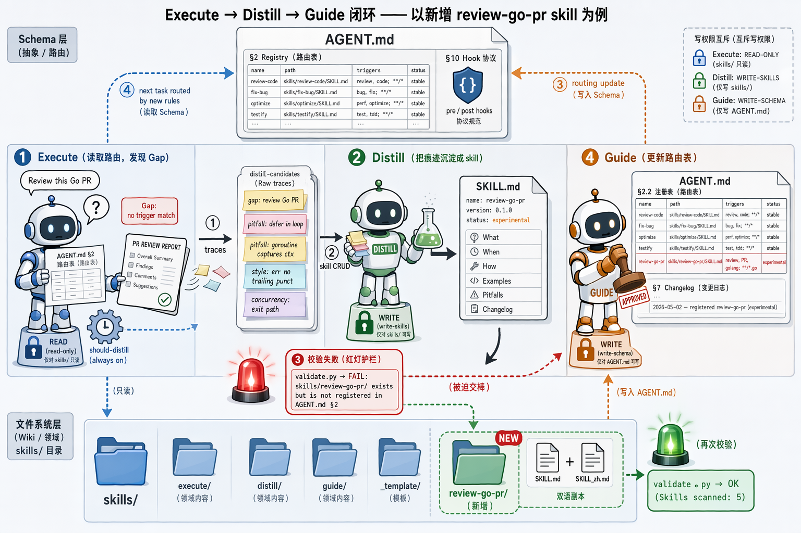

# llm-skill — Execute / Distill / Guide（中文）

> [English](./README.md) | 中文

借鉴 Karpathy 的 **[LLM-Wiki](https://gist.github.com/karpathy/442a6bf555914893e9891c11519de94f)** 思想，为 LLM Agent 设计的最小三层 skill 系统：



## 闭环

三个元技能（meta-skills）操作 skill 系统自身：

| 元技能 | 职责 | 产物 |
|---|---|---|
| **execute** | 读 `AGENT.md` 路由 → 加载最小 skill 子集 → 完成任务 → 记录可沉淀信号 | 交付 + `distill-candidates` |
| **distill** | 按契约把痕迹提炼为新/更 skill | `skills/<name>/SKILL.md` 变更 |
| **guide**   | 维护 `AGENT.md` 路由表与 skill 健康度 | `AGENT.md` 变更 |

```
 [Execute] ──痕迹──► [Distill] ──skill CRUD──► [Guide] ──路由──► [Execute] ...
```

## 目录结构

```
llm-skill/
├── README.md                       # 英文默认
├── README_zh.md                    # 本文件
├── CHANGELOG.md                    # 仅追加
├── AGENT.md                        # Schema：路由 + 契约（单一真相源）
├── AGENTS.md                       # Codex 入口
├── CLAUDE.md                       # Claude Code 入口
├── HERMES.md                       # HERMES 入口
├── install.sh                      # 一键安装 / 自检
├── scripts/
│   └── validate.py                 # front-matter + 路由表一致性校验
└── skills/
    ├── execute/     SKILL.md + SKILL_zh.md
    ├── distill/     SKILL.md + SKILL_zh.md
    ├── guide/       SKILL.md + SKILL_zh.md
    └── _template/   SKILL.md + SKILL_zh.md
```

端到端流程示意（Execute → Distill → Guide，以新增 `review-go-pr` skill 为例）：



## 安装

### 方式一 — 独立仓库
```bash
git clone <仓库地址> llm-skill
cd llm-skill
bash install.sh
```

### 方式二 — 挂载到已有项目
```bash
git clone <仓库地址> .llm-skill
ln -s .llm-skill/AGENT.md   ./AGENT.md
ln -s .llm-skill/AGENTS.md  ./AGENTS.md      # 给 Codex 使用
ln -s .llm-skill/CLAUDE.md  ./CLAUDE.md      # 给 Claude Code 使用
ln -s .llm-skill/HERMES.md  ./HERMES.md      # 给 HERMES 使用
ln -s .llm-skill/skills     ./skills
bash .llm-skill/install.sh
```

`install.sh` 会做目录结构检查并调用 `scripts/validate.py`。

## 快速上手

1. **执行任务** —— Agent 读 `AGENT.md` §2，路由到 ≤ 3 个 skill，执行，收集沉淀候选。
2. **新增 skill**：
   ```bash
   cp -r skills/_template skills/<你的 skill 名>
   # 编辑 SKILL.md（可选 SKILL_zh.md）
   # 让 agent 运行 guide，把它注册到 AGENT.md §2.2
   ```
3. **沉淀一次踩坑** —— 对 agent 说"沉淀一下"，它会走 `skills/distill/SKILL.md` 的四相 SOP。

## 设计不变量

- **领域知识只进 `SKILL.md`**，`AGENT.md` 只谈路由与契约。
- **职责互斥** —— Execute 对 skill 只读 / Distill 写 skill / Guide 只写 `AGENT.md`。
- **懒加载** —— 绝不 `ls skills/` 全读；先匹配 `triggers`，再加载 ≤ 3 个 `SKILL.md`。
- **两个生命体征** —— 每个 skill 都必须有 `version` 和 `status`。

完整契约见 [`AGENT.md`](./AGENT.md)。

## 兼容矩阵

| 运行时 | 入口文件 |
|---|---|
| Codex CLI | `AGENTS.md` |
| Claude Code | `CLAUDE.md` |
| HERMES | `HERMES.md` |
| 其它 | 直接读 `AGENT.md` |

## 许可证

基于 [MIT License](./LICENSE) 发布。

## Star 趋势

[](https://www.star-history.com/?repos=hanyuancheung%2Fllm-skill&type=date)
